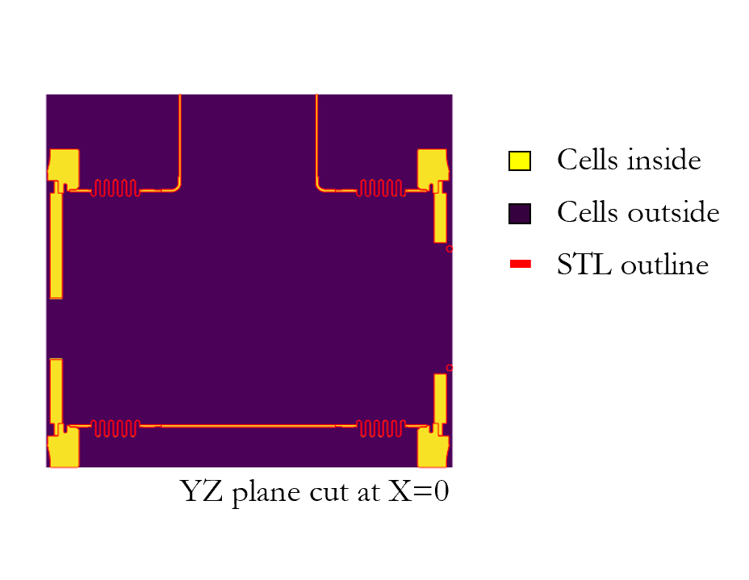
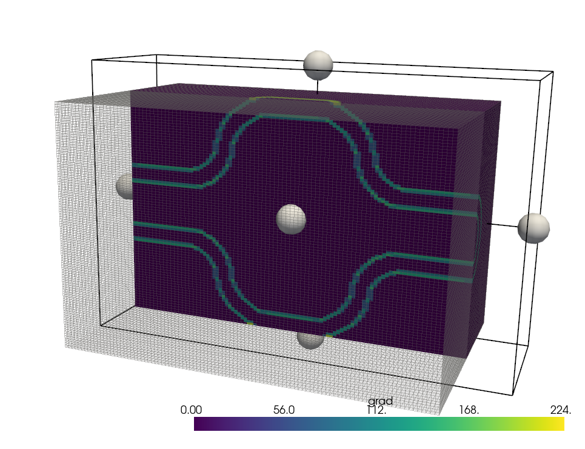
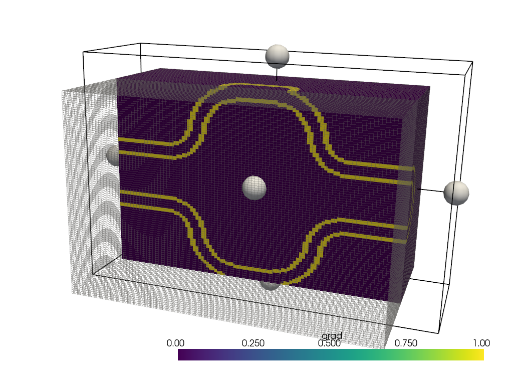
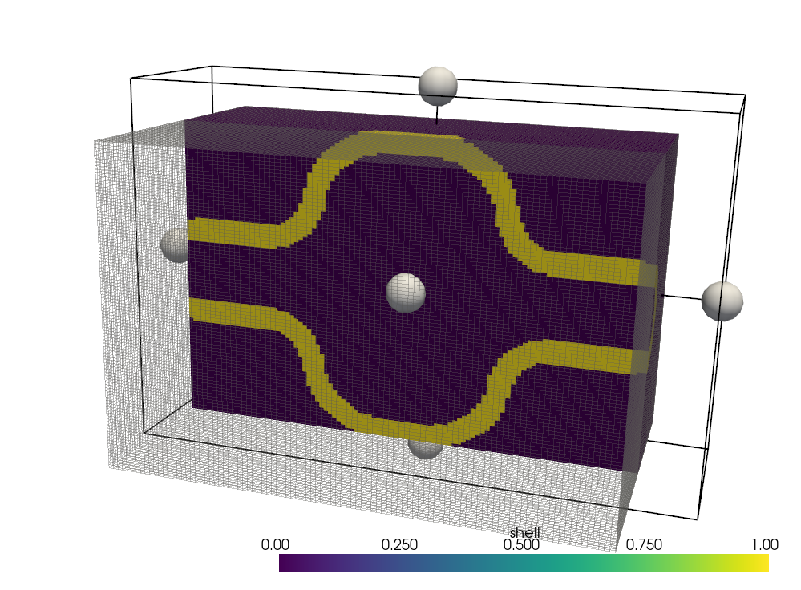

# 📚 Physics guide

This section provides the theoretical foundations behind Wakis, offering a clear and concise explanation of the physics principles and numerical methods that power the simulation engine.

We begin by revisiting Maxwell’s equations in their integral form and explaining how they are discretized using the Finite Integration Technique (FIT) on a structured Cartesian grid. The formulation naturally leads to Maxwell Grid Equations (MGEs), which are solved in time using a leapfrog scheme. The fields and material properties are represented on a Yee-type staggered lattice, and anisotropic or spatially varying materials are handled via sparse metric tensors.

Boundary conditions (PEC, PMC, periodic, Mur ABC, PML, and CPML) are discussed along with the treatment of sources and initial conditions. We also highlight how the solver supports geometry import and sub-pixel smoothing for embedded CAD models.

Finally, we cover the implementation aspects, including GPU acceleration with CuPy and parallelization with mpi4py, enabling high-resolution 3D simulations across multiple devices.

```{contents}
:depth: 3
```

## 1. Introduction

### 🎯 Motivation

In modern accelerators, precise knowledge of beam-coupling impedance and wakefields is essential to ensure beam quality, mitigate heating, and optimize component design. Analytical methods, while powerful, often fall short for realistic 3D geometries — this is where full electromagnetic solvers like Wakis become indispensable.

### 📖 Background

The evaluation of **beam-coupling impedance** and **wakefields** is fundamental to the design and operation of particle accelerators. As charged particle bunches traverse beamline components, they interact with material boundaries and geometric discontinuities, generating electromagnetic fields collectively known as **wakefields**.

These wakefields can:
- Degrade beam quality and cause **coherent instabilities**
- Induce **energy spread** and **emittance growth**
- Lead to **beam-induced heating** and **power loss** in accelerator components

In the **frequency domain**, the response of a structure to the passing beam is quantified by its **beam-coupling impedance** — a complex-valued function that encapsulates how each device stores and dissipates electromagnetic energy. The inverse Fourier transform of this impedance yields the **wake function**, describing the time-domain interaction between successive charged particles.

Accurate computation of the impedance and wake function is essential for:
- Predicting **collective beam dynamics**, such as instabilities and bunch deformation
- Estimating **power deposition** and guiding the **mechanical design** of beamline components

```{seealso}
* **🎯 Beam dynamic simulations**

To simulate collective beam dynamics and stability using impedance models, you can use the CERN-developed Python package [**Xsuite**](https://github.com/xsuite/xsuite), an open-source macroparticle tracking simulation code suite.
```

```{seealso}
* **💡 Beam Induced Heating**

The **dissipated power** due to beam-induced heating can be estimated using [BIHC](https://github.com/ImpedanCEI/BIHC), a tool within the Wakis ecosystem. It takes as input the impedance profile of a device and the beam spectrum, returning power loss predictions that are critical for **vacuum design**, **cooling**, and **material compliance**.
```


#### Analytical vs Numerical Approaches


Analytical methods offer elegant and accurate solutions for the beam-coupling impedance of **simplified geometries**. These are invaluable for physical insight and quick estimates in idealized cases such as:

- **Resistive wall pipes**
  Analytical expressions exist for round and elliptical beam pipes, characterizing impedance due to finite wall conductivity [Yokoya, 1993](https://cds.cern.ch/record/248630), [Migliorati et al., 2019](https://cds.cern.ch/record/2705426).

- **RF cavities**
  Resonant mode impedance and wake contributions can be calculated using modal expansion or equivalent circuits [Hofmann & Zotter, 1990](https://cds.cern.ch/record/196446), [Jensen, 2014](https://cds.cern.ch/record/1982429).

- **Tapers and step transitions**
  Important for matching sections and bellows, these can be described with slowly varying cross-section approximations [Yokoya, 1990](https://cds.cern.ch/record/210347), [Stupakov, 2007](https://link.aps.org/doi/10.1103/PhysRevSTAB.10.094401), [Palumbo et al., 1994](https://arxiv.org/abs/physics/0309023).


However, real-world accelerator components like:
- Beam Position Monitors (BPMs)
- Injection kickers
- RF-shielded bellows
- Complex collimators or cavities

...often have **no analytical solution**. These must be addressed through **full 3D numerical simulations** of Maxwell’s equations [Maxwell, 1865](https://royalsocietypublishing.org/doi/10.1098/rstl.1865.0008), using finite differences, finite elements, or finite integration.

```{tip}
* **🧑‍🏫 Why Use Time-Domain Solvers?**

Wakis employs a **time-domain approach** using the Finite Integration Technique (FIT), which offers key benefits:
- **Broadband response** in a single simulation
- Natural support for transient excitation (e.g., Gaussian bunch)
- Efficient use of explicit solvers with GPU and MPI support

This makes Wakis well-suited for impedance characterization across a **wide frequency range**, complementing frequency-domain solvers like CST or HFSS.

For a broader overview of impedance modeling, see [Metral et al., 2020](https://cds.cern.ch/record/2743945).
```


## 3. Electromagnetic Formulation

### ⚡🧲 Maxwell's Equations (Integral Form)

Wakis numerically solves Maxwell's equations in their **integral form**, which is fundamental to the Finite Integration Technique (FIT). This approach preserves the physical laws in their conservative form and naturally fits the discretization on structured grids.

The time-domain integral form of Maxwell's equations is:

$$
\begin{align}
\oint_{\partial A} \mathbf{E}\cdot \mathrm{d}\mathbf{s} &= -\iint_{A}\frac{\partial \mathbf{B}}{\partial t}\cdot \mathrm{d}\mathbf{A} \tag{1a}\\[6pt]
\oint_{\partial A} \mathbf{H}\cdot \mathrm{d}\mathbf{s} &= \iint_{A}\left(\frac{\partial \mathbf{D}}{\partial t} + \mathbf{J}\right)\cdot \mathrm{d}\mathbf{A} \tag{1b}\\[6pt]
\iint_{\partial V} \mathbf{B}\cdot \mathrm{d}\mathbf{A} &= 0 \tag{1c}\\[6pt]
\iint_{\partial V} \mathbf{D}\cdot \mathrm{d}\mathbf{A} &= \iiint_{V}\rho\, \mathrm{d}V \tag{1d}\\[6pt]
\mathbf{D} = \varepsilon \mathbf{E},\quad
\mathbf{B} &= \mu \mathbf{H},\quad
\mathbf{J} = \sigma \mathbf{E} + \rho\mathbf{v} \tag{1e}
\end{align}
$$

These laws describe:

- The evolution of electric $\mathbf{E}$ and magnetic $\mathbf{H}$ fields over time via their circulation around surfaces (Eqs. 1a–1b) and fluxes (magnetic flux density $\mathbf{B}$, electric displacement field $\mathbf{D}$)
- The coupling to sources through current density $\mathbf{J}$ and charge density $\rho$ (Eqs. 1b, 1d),
- The absence of magnetic monopoles (Eq. 1c),
- And the constitutive relations of the materials (Eq. 1e), which relate the physical fields to the medium’s electromagnetic properties: permittivity $\varepsilon$, permeability $\mu$, and conductivity $\sigma$, with $\mathbf{v}$ denoting the velocity of moving charges.

In these equations, $\varepsilon$, $\mu$, $\sigma$ can be considered tensors and frequency independent. To account for frequency or time dependency, the multiplication should be exchanged for a convolution $\ast$.

### 🧱 Discretization with the Finite Integration Technique (FIT)

Wakis discretizes the integral form of Maxwell's equations using the **Finite Integration Technique (FIT)** on a structured three-dimensional Cartesian grid.

$$
N_\text{cells} = N_x \times N_y \times N_z
$$

This approach maps:
- Line integrals → to grid **edges**
- Surface integrals → to grid **faces**
- Volume integrals → to grid **cells**


The resulting discretization yields the **Maxwell Grid Equations (MGE)**, which evolve the fields on a **staggered Yee-like lattice**. Specifically:
- $\vec{E}$ and $\vec{H}$ components are stored on **edges**
- $\vec{D}$ and $\vec{B}$ components are defined on **faces**
- Scalar quantities such as charge density reside at **cell centers**

This structure ensures that discrete curl, divergence, and gradient operators obey their continuous counterparts' conservation properties, which is critical for numerical stability and accuracy. By adopting the **Yee staggered grid** formulation and initially charge-free conditions, the divergence equations (1c–1d) are **satisfied implicitly** by construction.


#### Maxwell Grid Equations (MGE)

Following the FIT numerical method, the continuous Maxwell equations are converted into discrete update rules for the electric and magnetic fields:

$$
\begin{align}
\mathbf{C}\mathbf{D}_s \, \mathbf{e} &= -\mathbf{D}_A \, \frac{\partial (\mathbf{M}_{\mu} \mathbf{h})}{\partial t}  \tag{2a} \\[6pt]
\widetilde{\mathbf{C}}\widetilde{\mathbf{D}}_s \, \mathbf{h} &= \widetilde{\mathbf{D}}_A \left( \frac{\partial (\mathbf{M}_{\varepsilon} \mathbf{e})}{\partial t} + \mathbf{M}_{\sigma} \mathbf{e} + \mathbf{j}_{\text{src}} \right)  \tag{2b} \\[6pt]
\end{align}
$$

Where:
- $\mathbf{C}$ is the discrete **curl matrix**
- $\mathbf{C}^T$ is its transpose (used for magnetic curl)
- $\mathbf{D}_s$, $\widetilde{\mathbf{D}}_s$, $\mathbf{D}_A$, and $\widetilde{\mathbf{D}}_A$ are diagonal matrices representing cell edge lengths and face areas in the primal and dual~($\sim$) grids.
- The electromagnetic fields $\mathbf{e}, \mathbf{h}, \mathbf{j}$ are stored in memory as **1D vectors** of length $\{3N_\text{cells}\}$ stored in **lexicographic order**, encapsulated in the `Field` class.


The numerical method is implemented in `SolverFIT3D` class. The curl matrices are $\{3N_{cells}\times3N_{cells}\}$  sparse matrices with bands of +1 and -1. They are implemented efficiently in Wakis using `scipy.sparse` CSR format. The diagonal matrices also benefit from the `scipy.sparse.diags` object for optimized storage.

The electromagnetic fields are stored in a `numpy`-based `Field` object in Wakis:
- Supports `.toarray()` and `.fromarray()` for optimized modification during the time-stepping
- `.from_matrix()`, `.to_matrix()` to go from 1d to 3d matrix,automatically reshaped to the simulation grid dimensions.
- Interoperates with CuPy and MPI through magic methods and flags.
- `.inspect()` and other handy plotting methods
- Custom magic methods for multiplication, addition, division: `__div__`, `__add__`, `__mul__`
- `__getitem__`, `__setitem__` Getters and setters to access the 3D coordinates on-the-fly: apply intial conditions, sources, save states...

```{tip}
Thank's to the `Field` class, fields are stored in memory-continuous arrays for optimized performance, but can be accessed as a 3D matrix.
```

Some examples on how to access and operate `Field`s:
```python
# modify field slice in z-direction
solver.E[100, 20:30, :, 'z'] = 0.

# access cell value of the 123456th cell in lexico-graphic order
solver.H[123456]

# sum or multiply two field objects, keeping the Field
E_tot = solver_1.E + solver_2.E

# Calculate the energy (T_00)
T_00 = 0.5*(solver.E.get_abs()**2 + solver.H.get_abs()**2)

# Inspect the 3 components of the field in one line
solver.J.inspect()
```

This formulation enables stable, explicit time stepping and modular extensions to lossy media, materials, and sources.

#### Material tensors and grid information

Wakis distinguishes between **primal** and **dual** grid geometries as part of its Finite Integration Technique (FIT) formulation. The grid operations are implemented in Wakis' `GridFIT3D` class. Each quantity is mapped to a geometric entity and stored as a sparse diagonal matrix to enable fast, memory-efficient computations:

| Quantity                  | Description                                    |
|--------------------------|------------------------------------------------|
| $\mathbf{M}_\varepsilon^{-1}$ | Diagonal matrix of inverse permittivities              |
| $\mathbf{M}_\mu^{-1}$    | Diagonal matrix of inverse permeabilities      |
| $\mathbf{M}_\sigma$      | Diagonal matrix of electrical conductivities   |
| $\mathbf{D}_s$, $\widetilde{\mathbf{D}}_s$, $\mathbf{D}_A$, and $\widetilde{\mathbf{D}}_A$ | Edge lengths and face areas (primal/dual) |

To support **anisotropic materials** and **imported geometries**, Wakis stores the raw material data in structured `Field` objects — similar to 3D tensors — where values can be specified independently along the **x, y, and z directions** for each cell.

Before time-stepping, these directional fields are assembled into the corresponding **sparse diagonal matrices** using `scipy.sparse.diags`. This preserves the **locality of FIT updates** while enabling efficient CPU and GPU execution.

Wakis also supports spatially varying media, embedded materials from CAD imports, and subpixel smoothing, ensuring accurate representation of complex geometries and composite structures.

### 🕒 Time-Stepping Routine

Wakis uses the **Leapfrog scheme**, a second-order accurate and explicit time integrator. This method updates the magnetic and electric fields in a staggered fashion:

$$
\begin{align}
\mathbf{h}^{n+1} &= \mathbf{h}^n - \Delta t \, \widetilde{\mathbf{D}}_s \, \mathbf{M}_\mu^{-1} \, \mathbf{D}_A^{-1} \, \mathbf{C} \, \mathbf{e}^{n+0.5} \tag{3a} \\[6pt]
\mathbf{e}^{n+1.5} &= \mathbf{e}^{n+0.5} + \Delta t \, \mathbf{D}_s \, \widetilde{\mathbf{M}}_\varepsilon^{-1} \, \widetilde{\mathbf{D}}_A^{-1} \, \widetilde{\mathbf{C}} \, \mathbf{h}^n
- \widetilde{\mathbf{M}}_\varepsilon^{-1} \, \mathbf{j}_{\text{src}}^n
- \widetilde{\mathbf{M}}_\varepsilon^{-1} \, \widetilde{\mathbf{M}}_\sigma \, \mathbf{e}^{n+0.5} \tag{3b}
\end{align}
$$

Where:
- $\mathbf{C}$ and $\widetilde{\mathbf{C}}$ are discrete curl matrices on the primal and dual grids
- $\mathbf{D}_s$, $\mathbf{D}_A$ are diagonal matrices containing metric coefficients (edge lengths and face areas)
- Material properties enter through $\mathbf{M}_\mu$, $\mathbf{M}_\varepsilon$, and $\mathbf{M}_\sigma$

The timestep $\Delta t$ is constrained by:
- The **Courant–Friedrichs–Lewy (CFL)** condition
- Material relaxation times (for dispersive or lossy media)

Most matrix operations are precomputed and cached, enabling large-scale simulations with modest memory usage (~20M cells in <8 GB RAM/GPU).

### 🔌 Sources and Initial Conditions

Wakis allows arbitrary initial conditions on $\vec{E}$, $\vec{H}$, and $\vec{J}$. Sources can be defined in multiple ways:
- **User-defined time-dependent callbacks** placed after each step
- **Predefined source types**: Gaussian beams, dipoles, plane waves, laser pulses, available in `sources.py`

```{tip}
#### ⚙️ Source callbacks

A source callback can be easily created as:
- A function like `def update(solver, time)` placed in a `for` loop after each step `solver.one_step()`.
- a class with the method `Source.update(solver, time)`, passed to the `solver.emsolve()` routine.
```

#### Example: Gaussian Beam Current $J_z$

A rigid Gaussian bunch current is modeled as a line distribution:

$$
\mathbf{J}_z(x_{\text{src}}, y_{\text{src}}, \vec{z}) =
\frac{q \beta c}{\sqrt{2\pi} \sigma_z} \,
\exp\left( -\frac{(\vec{s} - s_0)^2}{2\sigma_z^2} \right)
$$

with:
- $\vec{s} = \vec{z} - \beta c t$: beam-frame coordinate
- $s_0 = z_{\min} - \beta c t_{\text{inj}}$: center of bunch
- $q$ the charge in $\text{nC}$
- $\sigma_z$ the bunch length in $\text{m}$

This supports both **ultra-relativistic** ($\beta \approx 1$) and **low-beta** scenarios.

To avoid parasitic fields interacting with the Perfect Matched Layer (PML) boundary, particle beams are only injected into the physical domain, excluding the PML region. To mitigate the divergence error fields that arise from this truncation, a Total-Field/Scattered-Field (TF/SF) formulation is applied [M.C. Balk et al., 2006].

The computational domain is divided into total-field and scattered-field regions, with the TF/SF boundary offset by one cell from the CPML interface. The beam is injected strictly within the total-field region, where the total field is defined as:

$$E^t = E^s + E^i$$

At the boundary, the curl operator is modified to add or subtract the incident fields, rendering the boundary transparent to field propagation. For ultrarelativistic beams, incident transverse electric fields are pre-calculated using a 2D Poisson solver and dynamically scaled by the instantaneous longitudinal current density during time integration.

### 🧊🔚 Boundary Conditions

Wakis supports several boundary condition (BC) types:
- **PEC (Perfect Electric Conductor)**: masks tangential electric-field degrees of freedom, enforcing $\vec{E}_{\parallel} = 0$ at the selected face.
- **PMC (Perfect Magnetic Conductor)**: masks tangential magnetic-field degrees of freedom, enforcing $\vec{H}_{\parallel} = 0$.
- **Periodic**: pairs the low and high faces of an axis and closes the corresponding FIT derivative stencil (`Px`, `Py`, or `Pz`) across that seam. The curl matrix is then rebuilt from the corrected derivative matrices and the periodic dual metrics are updated. A periodic face must be paired with the opposite face. Serial periodic boundaries are available in all three directions; longitudinal periodic MPI requires cyclic ghost exchange and is intentionally not enabled yet.
- **ABC**: a first-order Mur radiation condition for longitudinal faces.
- **PML**: a finite, graded, electrically lossy layer terminated by the usual electric boundary mask.
- **CPML**: a convolutional absorbing layer that adds auxiliary curl-correction fields.

#### Mur ABC implementation

The `abc` boundary applies the first-order Mur radiation condition to the
tangential electric field on a longitudinal (`z-` or `z+`) face. It approximates
the one-way wave equation

$$
\frac{\partial E_t}{\partial t} + v\frac{\partial E_t}{\partial n} = 0,
$$

where $E_t$ is either $E_x$ or $E_y$, $n$ is the outward longitudinal
coordinate, and the wave speed is taken from the homogeneous background
material,

$$
v = \frac{1}{\sqrt{\varepsilon_{\mathrm{bg}}\mu_{\mathrm{bg}}}}.
$$

For the low `z-` face, Wakis updates the boundary plane after the usual
electric and magnetic field step as

$$
E_t^{n+1}(0) = E_t^n(1) + r_{\mathrm{lo}}
\left[E_t^{n+1}(1) - E_t^n(0)\right],
$$

and, for the high `z+` face,

$$
E_t^{n+1}(N_z-1) = E_t^n(N_z-2) + r_{\mathrm{hi}}
\left[E_t^{n+1}(N_z-2) - E_t^n(N_z-1)\right].
$$

The face-local coefficient uses the adjacent cell spacing,

$$
r = \frac{v\Delta t - \Delta z}{v\Delta t + \Delta z}.
$$

Only the previous boundary and adjacent-interior $E_x$/$E_y$ planes are stored,
so the additional memory scales with the active boundary area rather than the
domain volume. This implementation leaves the FIT curl topology and metric
operators unchanged. It currently supports longitudinal faces only and is most
appropriate for waves close to normal incidence in a homogeneous background.
CPML remains the preferred absorber for oblique, broadband, low-frequency, or
evanescent fields.

#### PML implementation

An ideal PML is impedance matched to the adjacent medium while attenuating outgoing waves. For an interface between media A and B, the reflection coefficient is

$$
\Gamma = \frac{\eta_B - \eta_A}{\eta_B + \eta_A},
$$

where $\eta = \sqrt{\mu/\varepsilon}$ is the wave impedance. In a matched electric-and-magnetic lossy medium, the damping rates satisfy

$$
\frac{\sigma_{\mathrm{el}}}{\varepsilon}
= \frac{\sigma_{\mathrm{mag}}}{\mu}.
$$

This preserves the impedance while introducing attenuation. Equivalently, a PML can be formulated through complex coordinate stretching [Gedney et al., 2000]:

$$
s = 1 + \frac{\sigma}{j\omega\varepsilon_0}.
$$

The current Wakis `pml` boundary is a deliberately simple adiabatic absorber rather than a complete matched, stretched-coordinate PML. It adds a geometrically graded artificial electric conductivity to the PML cells and uses the regular electric-current update. The inverse permittivity in those cells is set to the vacuum value, and no corresponding artificial magnetic conductivity is applied. Consequently, its effectiveness depends on layer thickness and the low-conductivity ramp; it is not expected to be reflectionless, especially for oblique incidence, broadband pulses, or non-vacuum material at the interface.

#### CPML implementation

Convolutional PML (CPML) improves absorption of grazing-incidence, low-frequency, and evanescent fields by using a complex-frequency-shifted coordinate stretch [Gedney et al., 2000]:

$$
s = \kappa + \frac{\sigma}{\alpha + j\omega\varepsilon_0}.
$$

Here $\kappa \geq 1$ scales the coordinate stretch, $\sigma$ is the graded conductivity, and $\alpha$ is a non-negative frequency-shift parameter. Wakis constructs $\sigma$, $\kappa$, and $\alpha$ on both primal and dual field locations with a polynomial distance profile. It converts them into recursion coefficients and stores only the CPML auxiliary fields needed to correct curl terms inside each boundary layer.

CPML is therefore distinct from the scalar `pml` path: it does not modify the bulk material conductivity tensor to absorb waves, and its auxiliary convolution fields make it the preferred absorbing boundary for the beam and TF/SF workflows. As with all finite layers, its practical reflection level still depends on the number of cells and the selected profile parameters.


### 📥🗿 Geometry Importing & Embedded Boundaries

Wakis integrates with [**PyVista**](https://docs.pyvista.org/) to import CAD geometries in `.STL`, `.STEP`, or `.OBJ` formats. The mesh is overlaid onto the simulation domain and mapped onto the Cartesian grid using:
- `pyvista`'s surface collision algorithm, based on VTK optimized ray-tracing, allows to detect where the input geometry intersects the primal and dual grids.
- Assignment of material properties ($\varepsilon_r$, $\mu_r$, $\sigma$) in $x$, $y$, and $z$ to the intersected cells using a first-order subpixel smoothing, inspired by the open-source solver MEEP (MIT).

| STL geometry | Imported material mask |
| ----- | ---- |
|       |      |

Future versions aim to include a more advanced meshing algorithm for improved fidelity near corners and edges.

### Surface impedance boundary condition (SIBC)

When the metal walls are very good conductors and the skin depth is much smaller than the grid spacing, it becomes inefficient (and inaccurate) to resolve the fields inside the conductor volume. Instead of using a volumetric conductivity, Wakis can model such metals with a **Leontovich surface impedance boundary condition (SIBC)** applied only on the surface cells. This can be disabled in the solver by turning `use_sibc=False`

**🔍 Algorithm explanation**

Starting from the imported solid mask of the full volume, our algorithm tags the **surface of solid regions** by computing the gradient magnitude of a scalar field (e.g. material mask) and converting it to a boolean mask. It uses [PyVista's Gradient filter](https://docs.pyvista.org/api/core/_autosummary/pyvista.datasetfilters.compute_derivative):

The surface is identified where the gradient of the scalar field is non-zero:

$\|\nabla \phi\| = \sqrt{ (\partial_x \phi)^2 + (\partial_y \phi)^2 + (\partial_z \phi)^2 }$

Cells where $\|\nabla \phi\| > 0$ are marked as surface.

| SIBC  float  | SIBC bool                                                                             | No SIBC                                                                             |
| --- | ----------------------------------------------------------------------------------- | ----------------------------------------------------------------------------------- |
|     |  |  |

**See also:**
<details>
<summary> Maximum conductivity resolvable w/o a Leontovich boundary</summary>

To accurately model a conducting material volumetrically in FIT/FDTD, the **skin depth**

$$\delta = \sqrt{\frac{2}{2\pi f_{\max}\,\mu_0\,\sigma}}$$

must be resolved by the grid. A common requirement is at least **3 cells per skin depth**, i.e.

$$\delta \gtrsim 3\Delta_n$$

where $(\Delta_n)$ is the grid spacing normal to the wall, considered as $\sqrt{2}\cdot \text{min}(\Delta x, \Delta y, \Delta z)$. Substituting the skin-depth expression and solving for $\sigma$ gives the maximum conductivity that can be volumetrically resolved at a target frequency $f_{\max}$:

$$\sigma_{\max} = \frac{10}{\pi f_{\max}\,\mu \Delta_n^2}$$

Materials with $\sigma > \sigma_{\max}$ have a skin depth too small to be captured by the mesh and should be modeled using a **Leontovich (surface impedance) boundary condition** instead of volumetric conductivity.
</details>


<details>
<summary> Surface parameters for the Leontovich (SIBC) boundary</summary>

For a good conductor, the Leontovich surface impedance has the form

$$Z_s = (1+j)\sqrt{\dfrac{\omega\mu}{2\sigma}}$$

meaning that the resistive and reactive parts are equal (a $45^\circ$ phase).
In the SIBC implementation, we approximate $Z_s$ by its magnitude-based form

$$Z_s \approx \sqrt{\pi f_{\max}\mu / \sigma}$$

and define an equivalent **surface admittance**

$$Y_s = 1/Z_s$$

To embed this into the time-domain FIT update, we convert $Y_s$ into effective
surface parameters:
- **surface conductivity:** $\sigma_s = 1/Z_s$
- **surface permittivity term:** $\varepsilon_s = 1/Z_s$

Both appear with the same magnitude because the $45^\circ$ impedance angle implies
equal real and imaginary parts in the admittance. These values are applied only to
boundary edges or cells marked as SIBC, replacing the volumetric response of the metal.

</details>


### 🚀 GPU and MPI Parallelization

Wakis supports heterogeneous architecture computing thanks to open-source packages like:
- **GPU acceleration** using [**CuPy**](https://cupy.dev/) and `cupyx.scipy.sparse`
- Drop-in replacement of NumPy/SciPy operations when `use_gpu=True`
- **MPI parallelization** using [**mpi4py**](https://mpi4py.readthedocs.io/)
- Efficient longitudinal domain decomposition with ghost-cell synchronization
- Seamless integration with **multi-GPU** setups using both `cupy` and `mpi4py` memory passing protocols

```{note}
#### 👩‍💻 Developer Notes about Wakis
- Fully open-source and available on [GitHub](https://github.com/ImpedanCEI/wakis)
- Packaged on [PyPI](https://pypi.org/project/wakis/)
- Documented with `Sphinx` and hosted on `ReadTheDocs`: [https://wakis.readthedocs.io/](https://wakis.readthedocs.io/)
- Includes **CI/CD**, with end-to-end tests running nightly on GitHub actions, tagged **versioned releases**, and numerous **ready-to-run examples** in both Python scripts and notebooks, inluding a dedicated [playground](https://github.com/ImpedanCEI/CEI-logo) repository.
```

## 4. Wake potential, impedance, and wake factors

Wakis computes beam coupling impedance from time-domain electromagnetic field simulations by evaluating the wakefields generated by a moving charged particle (or bunch) as it traverses an accelerator structure.

### 📚 Wake function and wake potential

Wakis uses $s>0$ for a test particle behind the source and $v=\beta c$ for
the beam velocity. The transverse source and test positions are
$\mathbf r_s=(x_s,y_s)$ and $\mathbf r_t=(x_t,y_t)$.

The **wake function** $\mathbf w(\mathbf r_s,\mathbf r_t,s)$ is the response
of the structure to a point source. It is a Green function normalized by the
source charge $q_s$:

$$
\mathbf w(\mathbf r_s,\mathbf r_t,s)
=\frac{1}{q_s}\int_{-\infty}^{\infty}
\left[\mathbf E(\mathbf r_t,z,t)
+v\,\mathbf e_z\times\mathbf B(\mathbf r_t,z,t)\right]
_{t=(z+s)/v}\,dz .
$$

Its longitudinal component contains only $E_z$,

$$
w_\parallel(\mathbf r_s,\mathbf r_t,s)
=\frac{1}{q_s}\int_{-\infty}^{\infty}
E_z(\mathbf r_t,z,t=(z+s)/v)\,dz ,
$$

while the transverse component contains the transverse Lorentz force. Both
are quoted in $\mathrm{V/C}$, or more commonly $\mathrm{V/pC}$. A test charge
$q_t$ receives an integrated voltage $q_s w$ and an energy change proportional
to $q_tq_s w$; the sign depends on the charge and wake conventions.

A simulation uses a finite bunch rather than a point source. Let
$\lambda(s)$ be its **charge-normalized longitudinal profile**,

$$
\int_{-\infty}^{\infty}\lambda(s)\,ds=1,
\qquad [\lambda]=\mathrm{m}^{-1}.
$$

The resulting **wake potential** is the convolution

$$
W_{\parallel,\perp}(s)
=\int_{-\infty}^{\infty}
w_{\parallel,\perp}(s-s')\lambda(s')\,ds'.
$$

Thus $w$ denotes the point-charge response and $W$ the response to the bunch
profile. `WakeSolver.WP`, `WPx`, and `WPy` store the latter in
$\mathrm{V/pC}$. This distinction follows the definitions in
[Teofili et al., *Phys. Rev. Accel. Beams* **24**, 041001 (2021)](https://doi.org/10.1103/PhysRevAccelBeams.24.041001).

Wakis obtains the transverse wake potential from the 3D longitudinal wake
potential using the Panofsky--Wenzel relation. With the $s$ and force signs
used in Wakis,

$$
\frac{\partial\mathbf W_\perp}{\partial s}
=-\nabla_\perp W_\parallel,
$$

and therefore

$$
W_{\perp,\alpha}(s)
=-\frac{\partial}{\partial\alpha}
\int_{-\infty}^{s}W_\parallel(s')\,ds',
\qquad \alpha=x,y.
$$

The transverse gradient is evaluated with second-order finite differences.

#### Transverse decomposition

Wakis supports transverse wake analysis:

$$
W_{\perp,\alpha}(\mathbf r_s,\mathbf r_t,s)
=W_{C,\alpha}(s)
+W_{D,\alpha}(s)\Delta\alpha_s
+W_{Q,\alpha}(s)\Delta\alpha_t
+\mathcal O(\lVert\mathbf r\rVert^2),
\qquad \alpha=x,y.
$$

- $W_D$: **dipolar wake**, linear in source offset
- $W_Q$: **quadrupolar wake**, linear in test offset
- $W_C$: **coherent term**, for asymmetric geometries

They can be separated by sampling field responses at multiple
$(x_s,y_s,x_t,y_t)$ combinations, either by displacing the beam source or the
integration path.


### 🔁 From Wake to Impedance

Given the bunch profile $\lambda(s)$ and wake potential $W(s)$, Wakis obtains
the point-charge impedance by deconvolution. Define the spatial Fourier
transform

$$
\widetilde g(f)=\int_{-\infty}^{\infty}
g(s)e^{-i2\pi f s/v}\,ds .
$$

The charge-normalized bunch spectrum $\widetilde\lambda(f)$ is dimensionless.
With the Wakis sign convention, the impedances are

- **Longitudinal impedance** in $\Omega$:

$$
Z_\parallel(f)=-\frac{\widetilde W_\parallel(f)}
{v\,\widetilde\lambda(f)}
$$

- **Transverse impedance of the simulated offset** in $\Omega$:

$$
Z_{\perp,\alpha}(f)=i\frac{\widetilde W_{\perp,\alpha}(f)}
{v\,\widetilde\lambda(f)},
\qquad \alpha=x,y.
$$

`WakeSolver.Zx` and `Zy` contain this offset-dependent transverse impedance.
For a purely dipolar wake, division by the corresponding nonzero source
offset gives the commonly quoted dipolar impedance,

$$
Z_{\perp,\alpha}^{\mathrm{dip}}(f)
=\frac{Z_{\perp,\alpha}(f)}{\Delta\alpha_s},
\qquad [Z_{\perp}^{\mathrm{dip}}]=\Omega/\mathrm m.
$$

Wakis uses `numpy.fft` and zero-padding. No window is applied automatically.

### ⚖️ Loss and kick factors

The bunch **loss factor** is the bunch-profile-weighted longitudinal wake
potential:

$$
k_\parallel
=\frac{\displaystyle\int W_\parallel(s)\lambda(s)\,ds}
{\displaystyle\int\lambda(s)\,ds}.
$$

Because `WakeSolver.lambdas` is normalized, the denominator is ideally one;
it is retained in the numerical implementation to account for sampling or a
truncated profile. `calc_loss_factor()` returns the signed value in
$\mathrm{V/pC}$.

For a source offset $\Delta\alpha_s\ne0$, the dipolar **kick factor** is

$$
k_{\perp,\alpha}
=\frac{1}{\Delta\alpha_s}
\frac{\displaystyle\int W_{\perp,\alpha}(s)\lambda(s)\,ds}
{\displaystyle\int\lambda(s)\,ds},
\qquad \alpha=x,y.
$$

`calc_kick_factors()` returns signed $k_x$ and $k_y$ in
$\mathrm{V/(pC\,m)}$. A kick factor is undefined for a zero source offset, so
the corresponding result is `None`. In asymmetric structures, a coherent or
quadrupolar contribution may also be present; a single-offset division should
then not be interpreted as a pure dipolar coefficient.


```{admonition} Modularity

#### 🧪 Open-Source Compatibility

The wake and impedance analysis is performed within the `WakeSolver` class in `Wakesolver.py`. Even if this module is tailored for Wakis, it is completely modular and can be used with other EM solvers besides Wakis' `SolverFIT3D` output:
- It has been tested with **WarpX** EM fields. WarpX is a powerful open-source PIC solver for full 3D EM fields
- It has been benchmarked with **CST** Wakefield solver, using both EM field ouput (time-domain field monitors) and calculated wake potential and impedance. > See the full wake analysis benchmark in [IPAC'23 proceedings, E. de la Fuente](https://doi.org/10.18429/JACoW-IPAC2023-WEPL170).
- **Interoperability**: Wakis can read field maps in HDF5, CSV, or NumPy format
- **Subvolume extraction** and interpolation are supported for field-based post-processing
```
