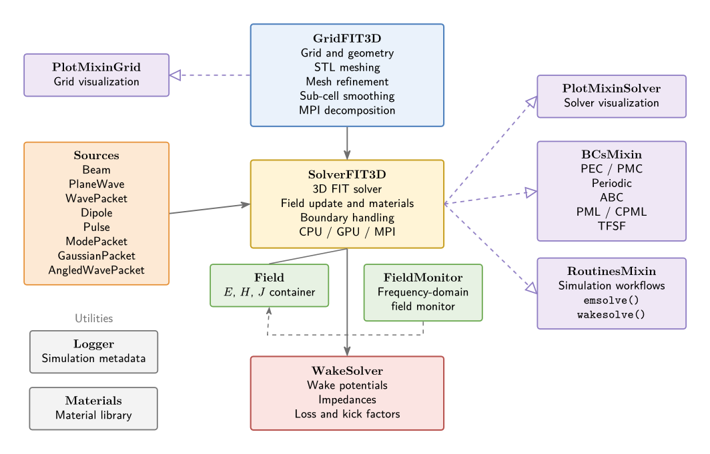

``wakis`` API Reference
-----------------------

Overview of ``wakis`` classes and functions, generated from their docstrings.

.. toctree::
   :maxdepth: 3

   wakis_gridFIT3D
   wakis_solverFIT3D
   wakis_wakeSolver
   wakis_field
   wakis_field_monitors
   wakis_sources
   wakis_materials
   wakis_geometry
   wakis_logger
   wakis_plotting
   wakis_routines
   wakis_boundaries
